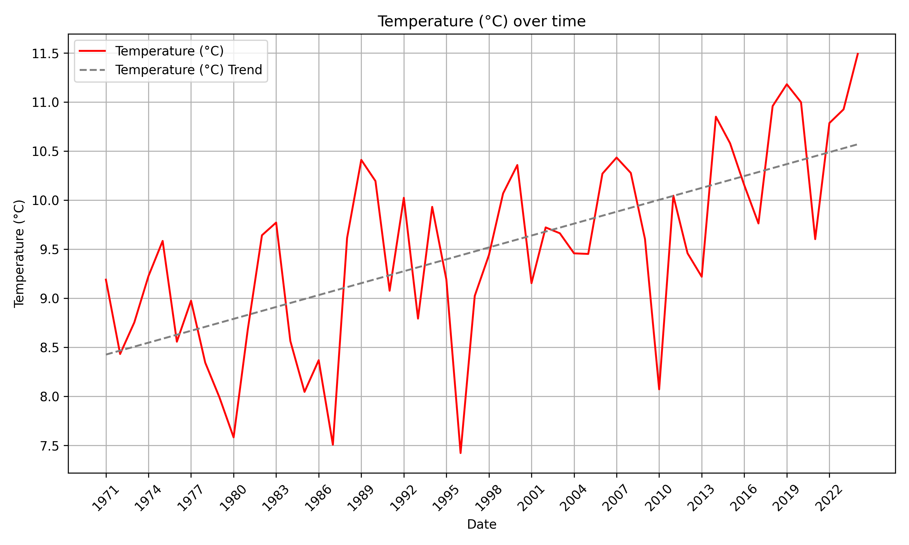
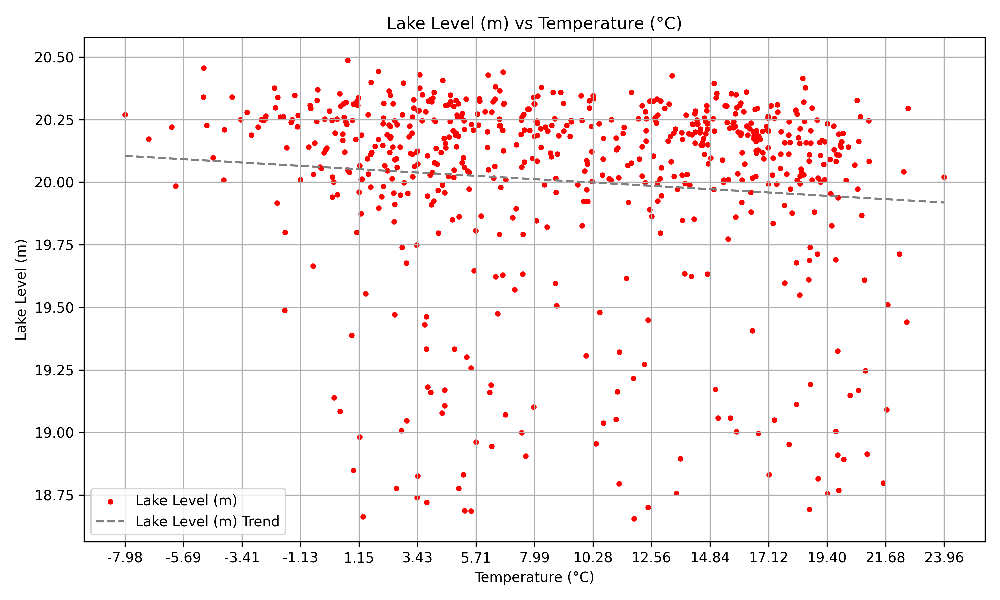

# Lake Trends Analyzer

**Lake Trends Analyzer** is a fast, modular Python app with both a graphical user interface (GUI) and command-line interface (CLI) for extracting insights from environmental data collected as part of the global **TOTCUS** water and climate research initiative.

Given a CSV of time-series measurements (lake level, temperature, humidity, precipitation, etc.), it automatically generates trend plots, correlation graphs, and lake level forecasts — enabling both exploratory analysis and actionable conclusions.

---

## 🌍 Project Context

This project supports our school’s participation in **TOTCUS**, a research initiative focusing on the effects of environmental factors on our aquatic ecosystems, from oceans to lakes and rivers. Our measurements come from a nearby lake and surrounding weather conditions.

**Lake Trends Analyzer** transforms raw measurements into visual insight, helping identify patterns, correlations, and potential long-term risks like lake desiccation.

---

## 🚀 Features

- 🖥️ **Graphical User Interface (GUI)**
  - Intuitive, fully featured GUI for data selection, analysis, and visualization
  - Easily select variables, view plots, and export results

- 💻 **Command-Line Interface (CLI)**
  - Scriptable CLI for automation and advanced users
  - Supports variable selection and batch processing

- 📈 **Automatic Graph Generation**
  - Time series plots for each variable with trendlines (seasonal graph feature included)
  - Correlation scatterplots (e.g. lake level vs. temperature), also with trendlines

- 🧠 **Forecasting & Warnings**
  - Predicts lake level for 1, 10, 50, and 100 years
  - Warns if the trend suggests drying out in a finite number of days

- 🗂 **Modular CSV Parsing**
  - New variables can be added without modifying the code structure

- 🎯 **Custom Output Control**
  - Select variables to analyze via GUI or CLI

- ⚡ **Fast Python Backend**
  - Written entirely in Python with Matplotlib for plotting, ensuring compatibility and ease of use

## 🎥 Demo


---

## ⚙️ Prerequisites

- Python 3.8 or higher
- Required packages: see `requirements.txt`

For a compatible CSV structure, see [data/2020s/data_from_2024.csv](data/2020s/data_from_2024.csv.csv).

---

## 🛠️ How to Run

### Using the GUI

```bash
python src/app/gui.py
```

- Launches the graphical interface for interactive analysis.

### Using the CLI

```bash
python src/app/cli.py path/to/your.csv [--variables temperature humidity lakelevel] [--y_variable_source path/to/csv/of/y-variable] [--y_variable 'y variable for correlations']
```

Examples:

- Generate all physical graphs (correlation plots showing how 'lakelevel' changes with parameters):
  ```bash
  python src/app/cli.py data/physical_data.csv --y_variable_source data/lakelevel_data.csv --y_variable lakelevel
  ```

- Only analyze temperature and humidity (correlation plots showing how 'chlorophyll a' changes with parameters):
  ```bash
  python src/app/cli.py data/physical_data.csv --variables temperature humidity --y_variable_source data/chemical_data.csv --y_variable 'chlorophyll a'
  ```

The supported variables depend on the headers of the respective csv sources.

---

## 🧪 Example Output

All graphs are auto-saved in the `output/` directory:

```bash
output/
├── timeseries_graphs/
│   ├── temperature_timeseries.png
│   ├── humidity_timeseries.png
│   └── …
└── correlation_graphs/
    ├── lakelevel/
        ├── temperature_correlation.png
        ├── humidity_correlation.png
    └── …
```

### 📈 Example Output of the Temperature Graphs with Lake Level Correlation

<p align="center">
  
  
</p>

Datasets are provided in the `data/` folder.

---

## 🧭 Roadmap

Planned improvements include:

- 📬 Automated email reports to project coordinators
- 🌐 Further enhancements to analysis and prediction tools
- 🖥️ Simple Web UI or enhanced CLI-based data entry (under consideration)

---

## 🤝 Contributions

This project was developed independently as part of a student contribution to the TOTCUS research effort. Collaboration and suggestions are welcome.  
All rights reserved.