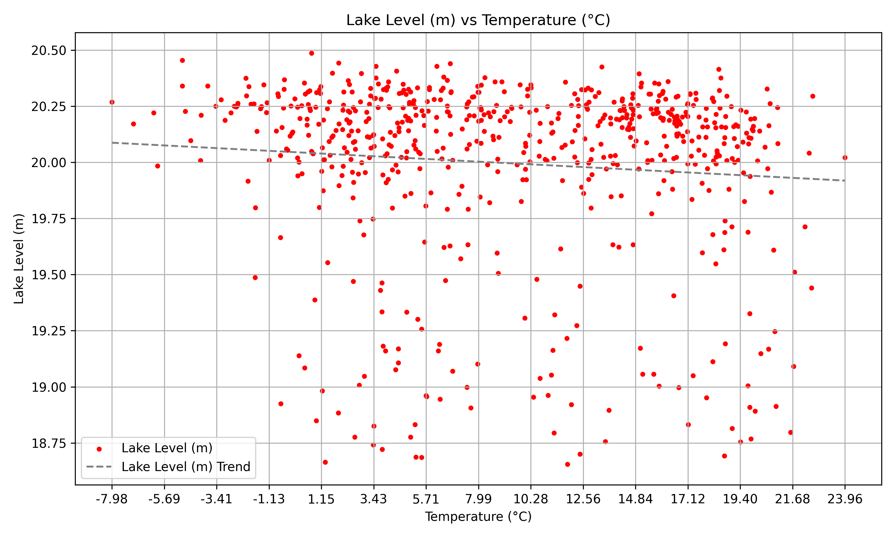

# Lake Trends Analyzer

**Lake Trends Analyzer** is a fast and modular Python app designed to extract insight from environmental data collected as part of the global **TOTCUS** water and climate research initiative.

Given a CSV of time-series measurements (lake level, temperature, humidity, precipitation, etc.), it automatically generates trend plots, correlation graphs, and lake level forecasts — enabling both exploratory analysis and actionable conclusions.

---

## 🌍 Project Context

This project supports our school’s participation in **TOTCUS**, a research initiative focusing on the effects of environmental factors on our aquatic ecosystems, from oceans to lakes and rivers. Our measurements come from a nearby lake and surrounding weather conditions.

**Lake Trends Analyzer** transforms raw measurements into visual insight, helping identify patterns, correlations, and potential long-term risks like lake desiccation.

---

## 🚀 Features

- 📈 **Automatic Graph Generation**
  - Time series plots for each variable with trendlines (seasonal graph feature included)
  - Correlation scatterplots (e.g. lake level vs. temperature), also with trendlines

- 🧠 **Forecasting & Warnings**
  - Predicts lake level for 1, 10, 50, and 100 years
  - Warns if the trend suggests drying out in a finite number of days

- 🗂 **Modular CSV Parsing**
  - New variables can be added without modifying the code structure

- 🎯 **Custom Output Control**
  - Use the `--variables` flag to limit output to specific variables or generate all at once

- ⚡ **Fast Python Backend**
  - Written entirely in Python with Matplotlib for plotting, ensuring compatibility and ease of use

---

## ⚙️ Prerequisites

- Python 3.8 or higher
- Required packages: see `requirements.txt`

For a compatible CSV structure, see [data/2020s/data_from_2024.csv](data/2020s/data_from_2024.csv.csv).

## 🛠️ How to Run

```bash
python src/main.py path/to/your.csv [--variables temperature humidity lakelevel]
```

Examples:

- Generate all graphs:
```bash
python src/main.py data/data_since_1970.csv
```

- Only analyze temperature and humidity:
```bash
python src/main.py data/data_since_1970.csv --variables temperature humidity
```

Supported variables include: `temperature`, `humidity`, `precipitation`, `windspeed`, and `lakelevel`.

## 🧪 Example Output

All graphs are auto-saved in the `output/` directory:

```bash
output/
├── timeseries_graphs/
│   ├── temperature_timeseries.png
│   ├── humidity_timeseries.png
│   └── …
└── correlation_graphs/
    ├── temperature_correlation.png
    ├── humidity_correlation.png
    └── …
```

### 📈 Example Output of the Temperature Graphs

<p align="center">
  
  
</p>

Datasets are provided in the `data/` folder.

---

## 🧭 Roadmap

Planned improvements include:

- ✅ Unit tests (currently in development) for reliability and correctness
- 📬 Automated email reports to project coordinators
- 🖥️ Simple Web UI or enhanced CLI-based data entry (under consideration)

---

## 🤝 Contributions

This project was developed independently as part of a student contribution to the TOTCUS research effort. Collaboration and suggestions are welcome.
All rights reserved.